# Proyecto de Aplicación de Magic the Gathering

Autores: **Sergio Prieto García** y **Manuel Cendón Rodríguez**

## 1. Introducción

### 1.1 Descripción del Proyecto

Este proyecto tiene como finalidad crear una aplicación que permita consultar información de las cartas del aclamado juego de cartas Magic: The Gathering. La aplicación permite buscar cartas por nombre y muestra la información más relevante de las mismas.


#### Funcionalidades principales:

- **Búsqueda de cartas:** La aplicación permite buscar cartas por nombre.
- **Información detallada:** Muestra información detallada de las cartas, como su nombre, tipo, coste de maná, color, fuerza y resistencia.
- **Interfaz gráfica:** La aplicación cuenta con una interfaz gráfica de usuario (GUI) que facilita la interacción con el usuario.
- **Base de datos:** La aplicación busca las cartas en una base de datos externa y muestra los resultados en la interfaz gráfica.
- **Gestión de errores:** La aplicación gestiona los errores que puedan surgir durante la búsqueda de cartas y muestra mensajes de error al usuario.
- **LogIn y Usuarios:** La aplicación cuenta con un sistema de logIn de usuarios para poder acceder a la información de las cartas de forma personalizada.


### 1.2 Descripción de la BBDD

La aplicación utiliza una base de datos externa para obtener la información de las cartas. La base de datos contiene información detallada de las cartas, como su nombre, tipo, coste de maná, color, fuerza y resistencia.

### 1.3 Tecnologías utilizadas
Este proyecto ha sido desarrollado con las siguientes tecnologías:
- **Java**: Lenguaje de programación principal utilizado.
- **JavaFX**: Para la creación de la interfaz gráfica de usuario (GUI).
- **FXML**: Lenguaje utilizado para diseñar las vistas de la aplicación.
- **Maven**: Utilizado para la gestión de dependencias y la construcción del proyecto.
- **Git**: Sistema de control de versiones utilizado para el desarrollo colaborativo del proyecto.
- **JDBC**: Para la conexión y consulta de la base de datos.
- **MySQL**: Base de datos utilizada para almacenar la información de las cartas.
- **Jackson**: Para la conversión de objetos Java a JSON.


## 2. Estructura del Proyecto

El proyecto sigue el patrón de arquitectura **MVC (Model-View-Controller)**.

- **Model**: Esta capa gestiona la lógica. Aquí se define la estructura de los datos y las interacciones con la API.
- **View**: Los archivos **FXML** definen la interfaz gráfica.
- **Controller**: Maneja la interacción entre el *model* y la *view*

## <u>Estructura del código</u>

## 2.1 Descripción de las clases en el paquete `controller`

1. **`LogInWindow`**: Esta clase maneja la funcionalidad de inicio de sesión de los usuarios. Permite que los usuarios ingresen sus credenciales y autentifica su acceso.

    - Métodos importantes:
        - **iniciarSesion(ActionEvent event)**: Cambia a la pantalla pricipal si se validaron correctamente las credenciales.
        - **validarCredenciales()**: método que valida si existe el usuario con la contraseña.


2. **`MainWindow`**: es la clase que maneja la pantalla principal.

    - Métodos importantes:
        - **establecerCarta()**: Es la función principal, se encarga de cargar las cartas o carta en la tabla.
        - **obtenerCartasFiltradas(String nombreCarta, String tipoPrecio, String tipoSet)**: se encarga de filtrar las cartas que aparece en la tabla dependiendo del nombre de la carta, precio o set.
        - **resetTable()**: devuelve la tabla a su estado principal, donde aparecen todas las cartas. 
        - **toExportView(ActionEvent event)**: cambia a la ventana de exportación. 
        - Los demás métodos, parecidos a este último, cambian a las distintas pantallas existentes.


4. **`ExportWindow`**: es la clase que maneja la ventana de exportación a JSON
    - Métodos importantes:
        - **exportData(ActionEvent event)**: Este método selecciona todas las cartas de la base de datos y las envía al transformador a JSON.


5. **`InsertWindow`**: es la clase que maneja la inserción de nuevas cartas.
    - Métodos importantes:
        - **addCard(ActionEvent event)**: Este método añade nuevas cartas a la base de datos cubriendo los campos que se piden.


6. **`DeleteWindow`**: es la clase que maneja la eliminación de cartas.
    - Métodos importantes:
        - **eliminarCarta(ActionEvent event)**: Este método elimina una carta segun su ID y nombre, para confirmarlo.


7. **`ModifyWindow`**: es la clase que maneja la ventana de exportación a JSON
    - Métodos importantes:
        - **modificarPrecio(ActionEvent event)**: Este método permite modificar el precio de cualquier carta de la base de datos si le proporcionas su nombre y su ID.
        

## 2.2 Descripción del paquete `services`

Este paquete contiene la lógica para exportar toda la base de datos a JSON. Su método más importante es  **saveAsJSON()** que procesa el String que guarda la base de datos 
y **updateJSON()**, que en caso de haber un archivo con un nombre ya existente lo actualiza con posibles cambios que se le hayan hecho a la base de datos.

## 2.3 Descripción del paquete `model`

Guarda las clases Java de todas las tablas de la base de datos **DB_MAGICTG.sql**.

## 2.4 Descripción del paquete `user`

Guarda la clase Java "User" de la base de datos **DB_LOGIN.sql**.

## 2.5 Descripción del paquete `conexion`

- Métodos importantes:
  - **crearConexion()**: Crea la conexión a la base de datos.
  - **listarCartasExport()**: Selecciona todas las cartas de la DB y lo formatea correctamente (parejas clave:valor) para que luego se exporte a un JSON bien formado
  - **readAllCards()**: Y sus variantes, dependiendo del filtro, cargan las cartas en la tabla de la ventana principal.
  
## 2.6 `src/main/resources` – Almacenamiento de FXML y Recursos

La carpeta `edu/badpals/db_magictg/resources` contiene todos los archivos necesarios para la interfaz gráfica de usuario y otros recursos estáticos, como las bases de datos que usamos.

### Subcarpetas clave y archivos:

**Archivos FXML principales**:
- **`Add_Card_view.fxml`**: Define el diseño de la pantalla de crear una carta nueva.
- **`Delete_card_view.fxml`**:  Define la estructura de la pantalla que muestra el menú de eliminar una carta de la base de datos.
- **`export_view.fxml`**: Define la estructura de la pantalla que muestra el menú de exportación de las cartas.
- **`Log_in_view.fxml`**: Define la estructura de la pantalla que muestra el menú de inicio para acceder a la aplicación.
- **`Main_view_MTG.fxml`**: Define la estructura de la pantalla principal donde se visualiza la lista de cartas con sus datos y los filtros.
- **`Modify_Price_view.fxml`**: Define la estructura de la pantalla que muestra el menú de cambio de precio de una carta.

### Relación entre los controladores y los archivos FXML

Cada archivo FXML tiene asociado un archivo Java en el paquete de **controller** con un nombre similar.


# <u>Manual para Desarrolladores</u>

## Requisitos del Sistema
### Antes de comenzar, asegúrate de que tienes instalados los siguientes componentes en tu sistema:
1. JDK 21: Necesario para compilar y ejecutar aplicaciones Java.
2. JavaFX 17: Usado para la interfaz gráfica de usuario (GUI) en Java.
3. Maven: Herramienta para la gestión de proyectos y dependencias en Java.
4. Git: Sistema de control de versiones para gestionar el código fuente.
5. MySQL o un SGBD compatible: Necesario para cargar las dos bases de datos en local.

## Instrucciones de Instalación

### 1. Sitúate donde quieras crear la app:

```bash
cd C:\Users\nombredeusuario\Desktop
```
### 2. Crea un directorio donde almacenar la app:

```bash
  mkdir Directory
```

### 3.Sitúate en el directorio:

```bash
  cd Directory
```

### 4.Instala los requisitos:

#### Instalar JDK 21:

- Si no tienes JDK instalado, descárgalo e instálalo desde Oracle JDK 21.
- Durante la instalación, asegúrate de seleccionar la opción de añadir Java al PATH para que puedas usarlo desde la línea de comandos.

- Verifica la instalación de Java ejecutando el siguiente comando en la terminal:
```bash
java --version

```
#### Instalar JavaFX 17:

- Descarga JavaFX 17 desde [Gluon](https://gluonhq.com/products/javafx/).
- Descomprime el archivo descargado en un directorio de tu elección.
- Debes configurar las variables de entorno para JavaFX. En Windows, añade la ruta del directorio lib de JavaFX a la variable de entorno PATH.
- Para verificar, puedes ejecutar el siguiente comando, reemplazando ruta_a_javafx por la ruta de la carpeta lib:
```bash
set PATH=%PATH%;ruta_a_javafx\lib
```
#### Instalar Maven:
- Si no tienes Maven instalado, descárgalo e instálalo desde [Apache Maven](https://maven.apache.org/download.cgi).
- Descomprime el archivo descargado en un directorio de tu elección.
- Añade la ruta de la carpeta bin de Maven a la variable de entorno PATH.
- Para verificar la instalación, ejecuta el siguiente comando en la terminal:
```bash
mvn --version
```
#### Instalar Git:
- Si no tienes Git instalado, descárgalo e instálalo desde [Git](https://git-scm.com/downloads).
- Durante la instalación, asegúrate de seleccionar la opción de añadir Git al PATH para que puedas usarlo desde la línea de comandos.
- Verifica la instalación de Git ejecutando el siguiente comando en la terminal:
```bash
git --version
```
### 5. Clona el repositorio de la aplicación:

```bash
   git clone https://github.com/Semperz/DB_MagicTG.git
```

### 6. Sitúate en el directorio del proyecto:

```bash
    cd DB_MagicTG
  ```

### 7. Instala las dependencias del proyecto:
```bash
    mvn  install
```
### 8. Ejecuta la aplicación:
#### Para Crear el JAR

```bash
    mvn clean package
```

#### Para ejecutar con el JAR

```bash
    
 java --module-path="ruta al directorio del SDKS" --add-modules=javafx.base,javafx.controls,javafx.fxml,javafx.graphics,javafx.swing,javafx.media
```

# <u>Manual de Usuario</u>

## Inicio de Sesión

Al abrir la aplicación, te llevará a la pantalla de LogIn.
En ella deberás introducir tu nombre de usuario y contraseña:

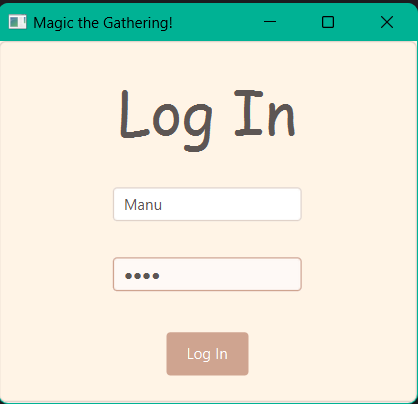

Si introduces un usuario que no existe, te saltará un mensaje de error:

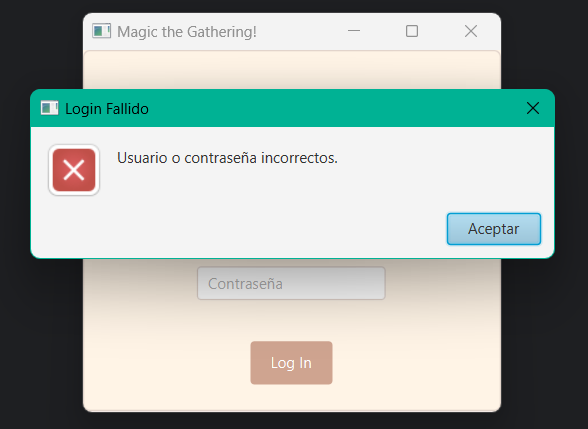

Si introduces un usuario que sí existe, te saldrá una notificación de que has iniciado sesión correctamente:

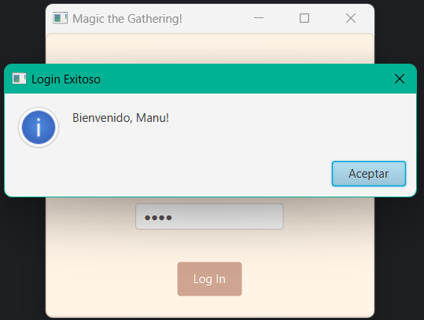

Una vez has introducido las credenciales correctamente te llevará a la pantalla principal:

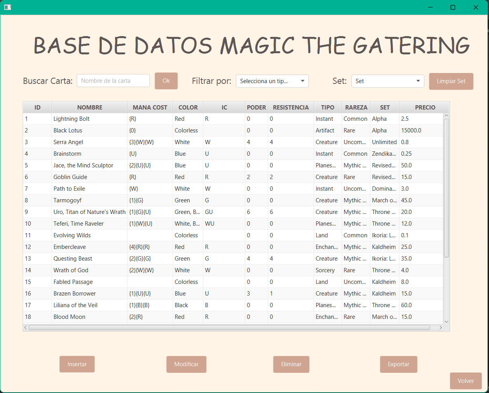

Puedes filtrar por nombre:

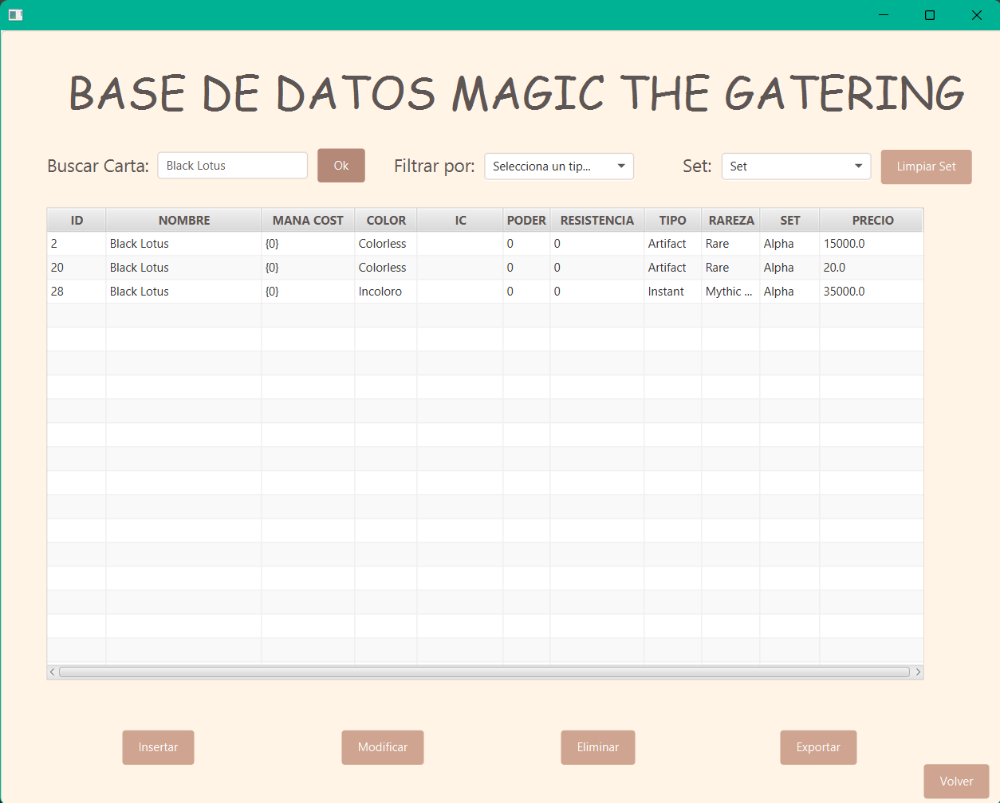

Por Precio:

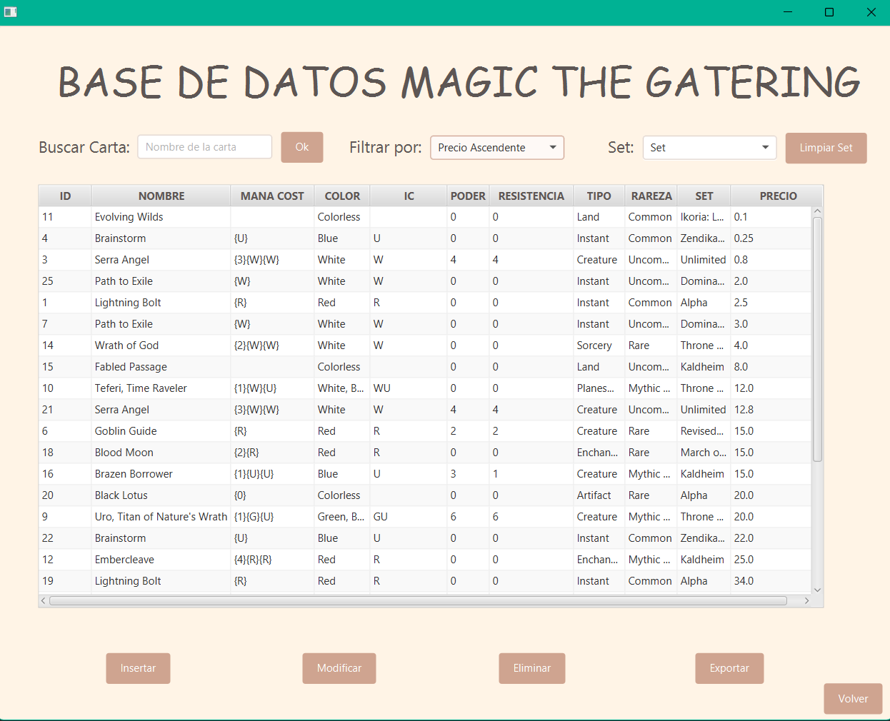

Por Set:

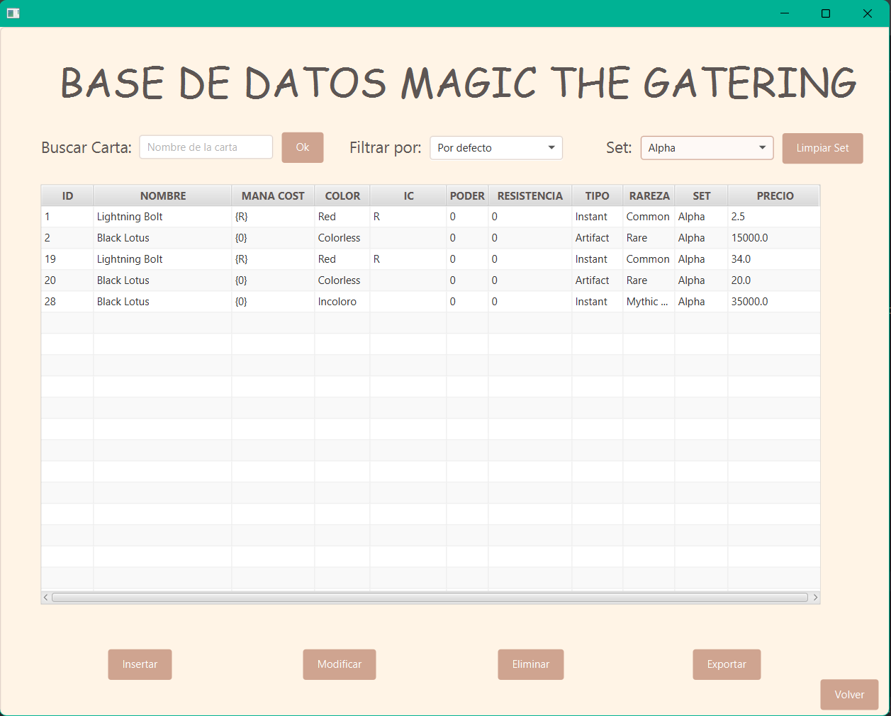

O por cualquier combinación de los tres: 

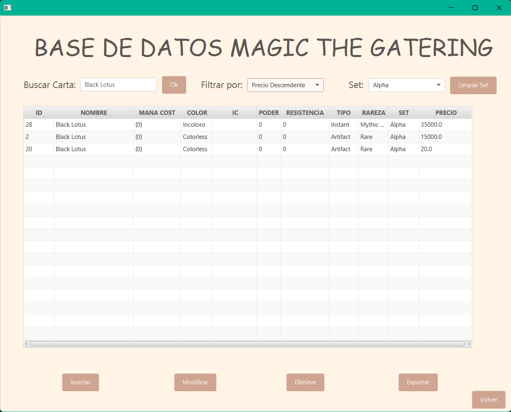

Si decides ir a la pantalla de exportación de datos.
En ella puedes elegir el nombre del archivo Json, esta será tu vista:

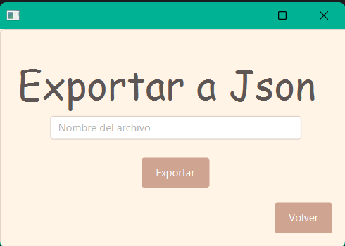

Una vez introducido el nombre el archivo se te guardará en la carpeta exports:


Si no introduces un nombre te lanzará un mensaje de error:

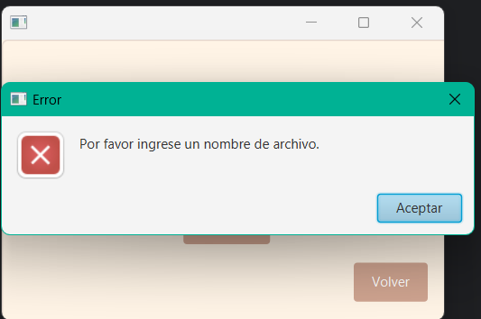

En caso de que introduzcas algún nombre te avisará de que la exportación se ha realizado correctamente:

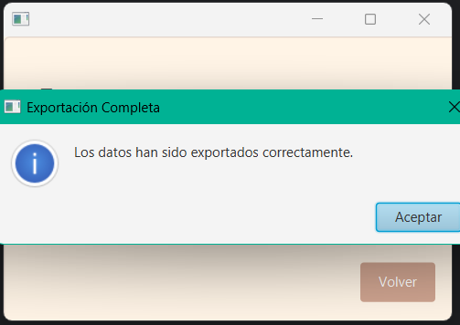

Si seleccionas la opción de introducir una carta, esta será la vista:

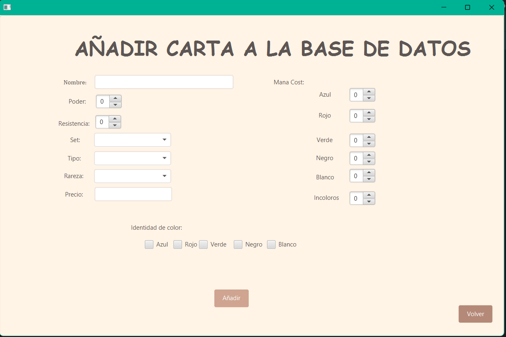

Debes introducir todos los datos o te saldrá un mensaje de error:

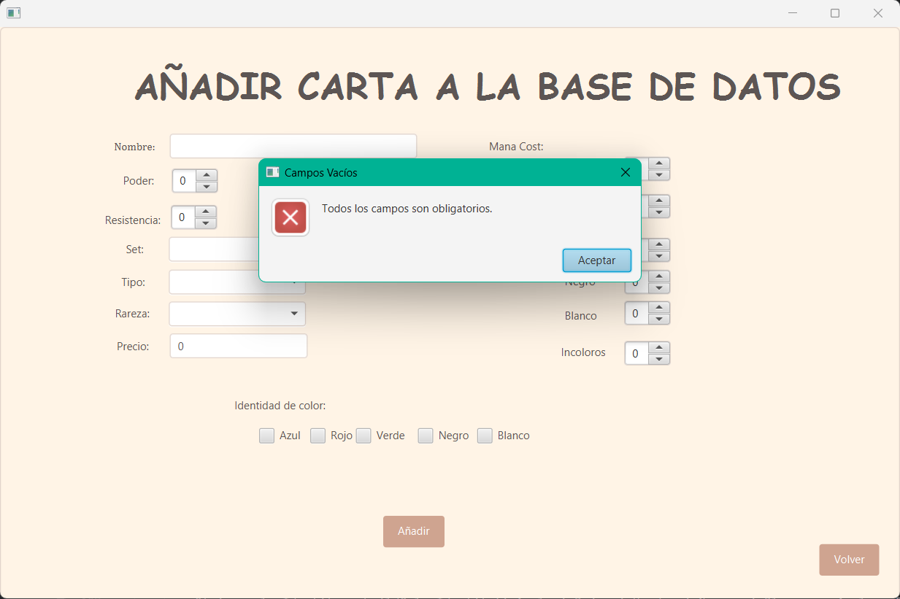

Una vez introducidos los datos correctamente, te saldrá un mensaje de confirmación:

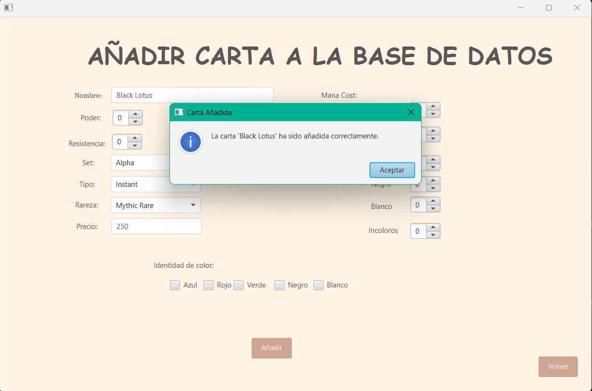

Si decides ir a la pantalla de eliminación de datos.
Debes proporcionas el nombre y el ID de la carta que deseas eliminar, esta será tu vista:

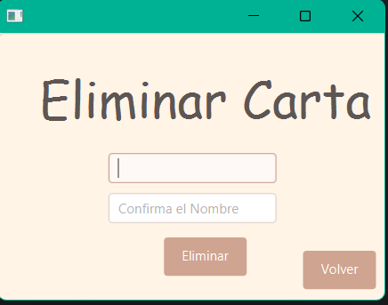

Una vez introducidos los datos correctamente, te saldrá un mensaje de confirmación:

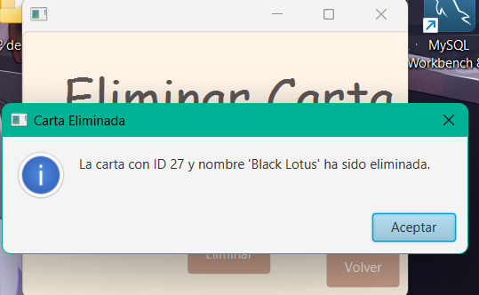

Si introduces una combinación de datos que no existe, te saldrá un mensaje de error:

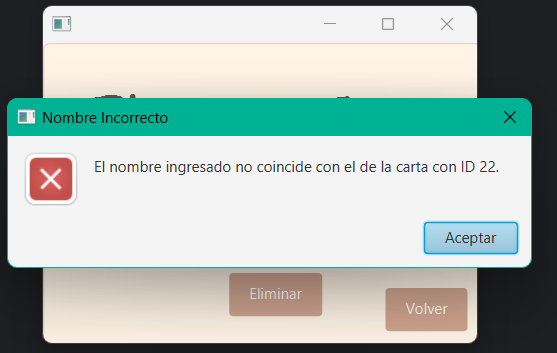

Si decides ir a la pantalla de modificación de datos.
Debes introducir el ID y el nombre de la carta que deseas modificar, además del nuevo precio de la carta, esta será tu vista:

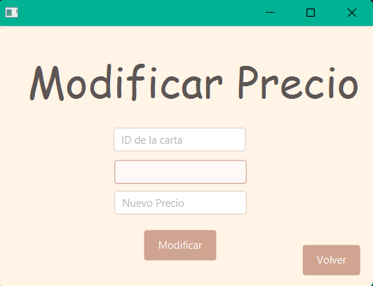

Una vez introducidos los datos correctamente, te saldrá un mensaje de confirmación:

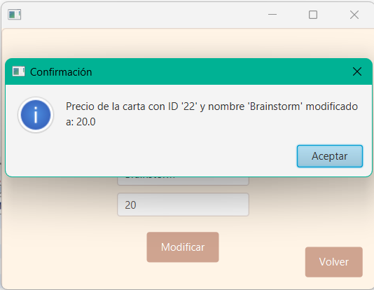

Si introduces una combinación de datos que no existe, te saldrá un mensaje de error:

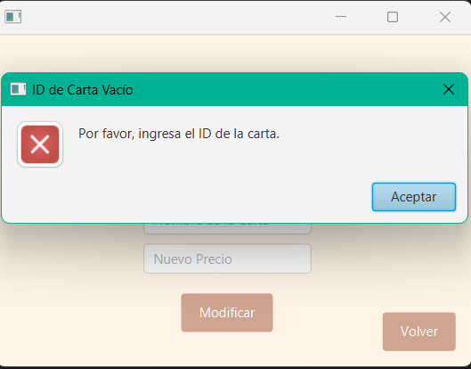

Los botones volver siempre vuelven a la pestaña posterior, es decir las acciones siempre te devuelven a la pestaña principal.

Y la pestaña principal siempre te devuelve al log in.


# Extras Realizados

1. **Control de errores**(errores de ficheros, consultas sin resultados...).
- Se muestran mensajes de error si no se encuentran resultados o si hay problemas con los ficheros.
- Se manejan excepciones para evitar fallos en la aplicación.
- Si el usuario introduce credenciales incorrectas, se muestra un mensaje de error.

2. **Ordenación de Resultados**.
- Se ordenan los resultados de la búsqueda por ID.
- Se le pregunta al usuario si quiere filtrar por precio ascendente o descendente.
- Se le pregunta al usuario que Set de cartas quiere ver.


4. Adición de un login (control de acceso restringido) con usuario y contraseña.
- Se añade un sistema de inicio de sesión con credenciales almacenadas en una BBDD externa.
- Los usuarios deben autenticarse para acceder a la aplicación.


# Tiempo dedicado
- **Sergio Prieto García**: 36 horas
- Tareas:
    - Establecimiento de la estructura del proyecto
    - Creación de la interfaz gráfica
    - Implementación de la búsqueda de cartas
    - Implementación de la exportación de datos
    - Documentación
    - Control de errores


- **Manuel Cendón Rodríguez**: 35 horas
- Tareas:
    - Sentencias básicas de SQL (Modify, Insert, Delete)
    - Control de errores
    - Adición de un login
    - Documentación
    - Interfaz gráfica


# Propuestas de Mejora del proyecto

1. **Mejora de la interfaz gráfica**
2. **Implementación de un sistema de favoritos**
3. **Añadir más opciones de exportación**
4. **Añadir más opciones de búsqueda**

# Propuestas de Mejora para el profesor

1. **Utilizar un ejecutable en lugar de un .jar**
2. **Dejar de usar JavaFX**

# Conclusiones

- En este proyecto hemos seguido mejorando nuestro conocimiento con javaFX y JDBC.
- Hemos aprendido a obtener datos directamente de la base de datos.
- Hemos mejorado nuestro conocimiento sobre el manejo de las excepciones.
- 

# Nota Esperada

Tras haber invertido 1 semana, haber tenido problemas con el javaFX y el como obtener los datos, asi como las largas sentencias SQL necesarias dada la naturaleza de nuestra BBDD, creemos que un 8,5 es una nota mas que razonable, a pesar de la pobre interfaz gráfica.
